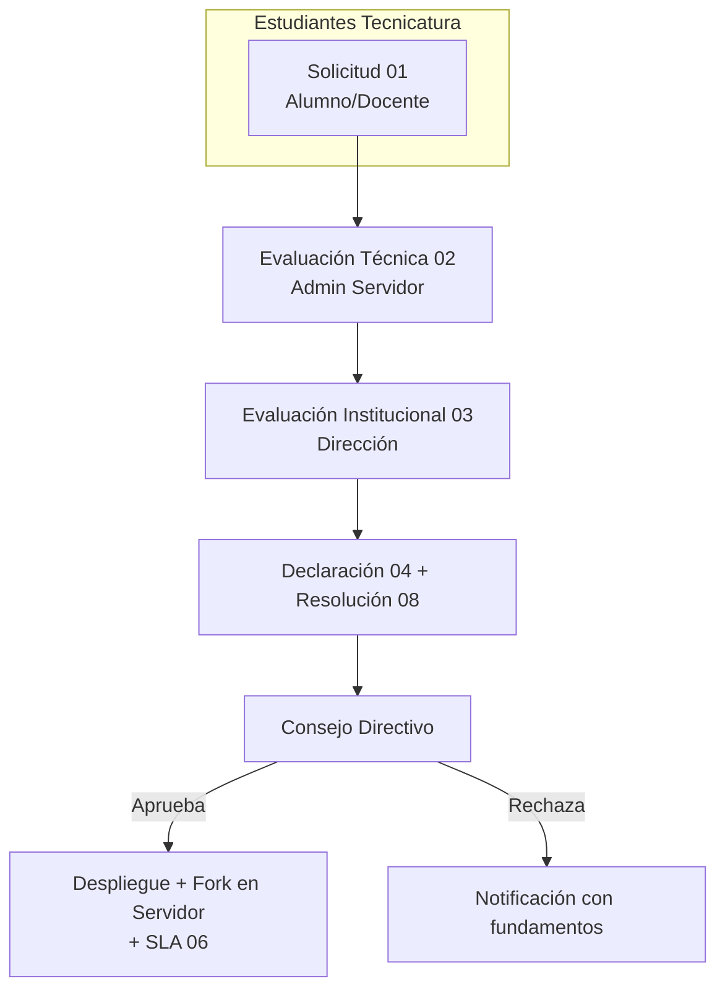

# Gobernanza de Servicios Digitales — IES 9-018

**Versión:** v0.9 — Beta Institucional
**Repositorio:** [IES9018/gobernanza-servicios-digitales](https://github.com/IES9018/gobernanza-servicios-digitales)

Marco institucional para solicitar, evaluar, aprobar, alojar y suspender servicios digitales en el servidor del IES 9-018.

> El alojamiento en infraestructura institucional **no implica aprobación, supervisión ni responsabilidad** del IES 9-018.

## Flujo de aprobación

## Documentos

| # | Documento |
|---|-----------|
| 00 | [Índice general](docs/00_INDICE.md) (empezar aquí) |
| 01 | [Solicitud de Alojamiento](docs/01_SOLICITUD_ALOJAMIENTO.md) |
| 02 | [Evaluación Técnica](docs/02_EVALUACION_TECNICA.md) |
| 03 | [Evaluación Institucional](docs/03_EVALUACION_INSTITUCIONAL.md) |
| 04 | [Declaración de Responsabilidad](docs/04_DECLARACION_RESPONSABILIDAD.md) |
| 05 | [Política de Uso Aceptable](docs/05_POLITICA_USO_ACEPTABLE.md) |
| 06 | [SLA Educativo](docs/06_SLA_EDUCATIVO.md) |
| 07 | [Solicitud de Usuario](docs/07_SOLICITUD_USUARIO.md) |
| 08 | [Resolución Directiva](docs/08_RESOLUCION_DIRECTIVA.md) |
| 09 | [Guía Técnica de Auditoría](docs/09_AUDITABILIDAD.md) |
| 10 | [Glosario](docs/10_GLOSARIO.md) |
| 11 | [Emergencia y Control](docs/11_EMERGENCIA_Y_CONTROL.md) |
| 12 | [Transparencia y Auditoría Comunitaria](docs/12_TRANSPARENCIA_COMUNITARIA.md) |

[Plantillas](plantillas/) · [CHANGELOG](CHANGELOG.md) · [Índice completo](docs/00_INDICE.md)
