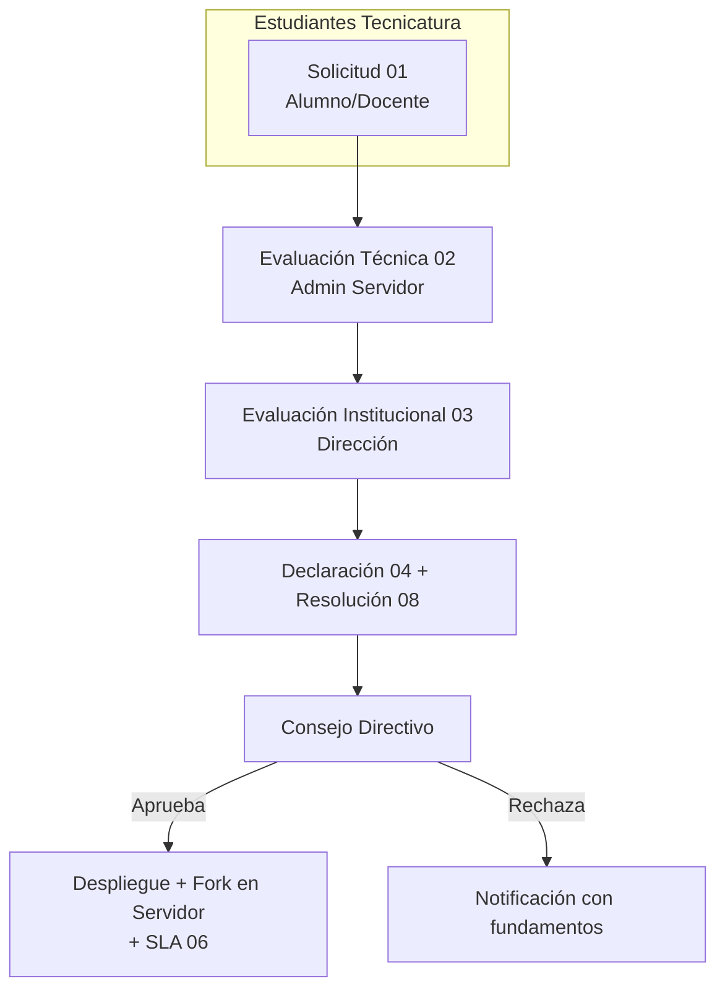

# Gobernanza de Servicios Digitales — IES 9-018

**Versión:** v0.9 — Beta Institucional
**Repositorio:** [IES9018/gobernanza-servicios-digitales](https://github.com/IES9018/gobernanza-servicios-digitales)

Marco institucional para solicitar, evaluar, aprobar, alojar y suspender servicios digitales en el servidor del IES 9-018.

> El alojamiento en infraestructura institucional **no implica aprobación, supervisión ni responsabilidad** del IES 9-018.

### Propiedad del dominio institucional

El dominio **ies9018malargue.edu.ar** y **todos sus subdominios** son propiedad
exclusiva del IES 9-018. Ningún servicio podrá publicarse bajo este dominio o
subdominios sin la aprobación formal del proceso de gobernanza
(documentos 01 al 08).

El administrador técnico es la única persona autorizada para realizar cambios
de DNS y asignación de subdominios.

---

## Flujo de aprobación

## Documentos

| # | Documento |
|---|-----------|
| 00 | [Índice general](docs/00_INDICE.md) (empezar aquí) |
| 01 | [Solicitud de Alojamiento](docs/01_SOLICITUD_ALOJAMIENTO.md) |
| 02 | [Evaluación Técnica](docs/02_EVALUACION_TECNICA.md) |
| 03 | [Evaluación Institucional](docs/03_EVALUACION_INSTITUCIONAL.md) |
| 04 | [Declaración de Responsabilidad](docs/04_DECLARACION_RESPONSABILIDAD.md) |
| 05 | [Política de Uso Aceptable](docs/05_POLITICA_USO_ACEPTABLE.md) |
| 06 | [SLA Educativo](docs/06_SLA_EDUCATIVO.md) |
| 07 | [Solicitud de Usuario](docs/07_SOLICITUD_USUARIO.md) |
| 08 | [Resolución Directiva](docs/08_RESOLUCION_DIRECTIVA.md) |
| 09 | [Guía Técnica de Auditoría](docs/09_AUDITABILIDAD.md) |
| 10 | [Glosario](docs/10_GLOSARIO.md) |
| 11 | [Emergencia y Control](docs/11_EMERGENCIA_Y_CONTROL.md) |
| 12 | [Transparencia y Auditoría Comunitaria](docs/12_TRANSPARENCIA_COMUNITARIA.md) |

---

## Colaborá con este proyecto

Este marco de gobernanza es un proyecto **colaborativo, abierto y educativo**,
impulsado desde la **Tecnicatura Superior en Desarrollo de Software** del
IES 9-018. La [organización de GitHub IES9018](https://github.com/IES9018)
ya tiene proyectos activos — como los laboratorios de Programación III, los
trabajos de Modelado de Software y prácticas profesionalizantes — y este
repositorio busca seguir ese mismo camino.

### ¿Por qué participar?

- **Experiencia profesional real**: trabajás sobre un sistema que la institución
  necesita, con requisitos reales, revisión de código y despliegue en producción.
- **Proyecto integrador**: perfecto para materias como Práctica Profesionalizante,
  Modelado de Software o Arquitectura y Diseño de Interfaces.
- **Portfolio**: tu código firmado queda público y visible para futuros empleadores.
- **Trabajo colaborativo**: aprendés a usar Issues, PRs, forks, code review y
  GitFlow en un entorno real con otros estudiantes.

### ¿Qué viene después? — Sistema web de gestión

Este marco documental es el paso 1. El **paso 2** es desarrollar un **sistema
web liviano** para digitalizar todo el proceso: carga de solicitudes,
evaluaciones técnicas e institucionales, seguimiento de estados, catálogo de
servicios activos y dashboard para el Consejo Directivo.

Será 100% open source, desarrollado por estudiantes de la Tecnicatura, y
una oportunidad única de participar en un proyecto de código abierto desde
cero. Todo se gestiona por [Issues](https://github.com/IES9018/gobernanza-servicios-digitales/issues).
Si querés participar, leé [CONTRIBUTING.md](CONTRIBUTING.md) y sumate.

[Plantillas](plantillas/) · [CHANGELOG](CHANGELOG.md) · [Índice completo](docs/00_INDICE.md) · [Cómo contribuir](CONTRIBUTING.md)
