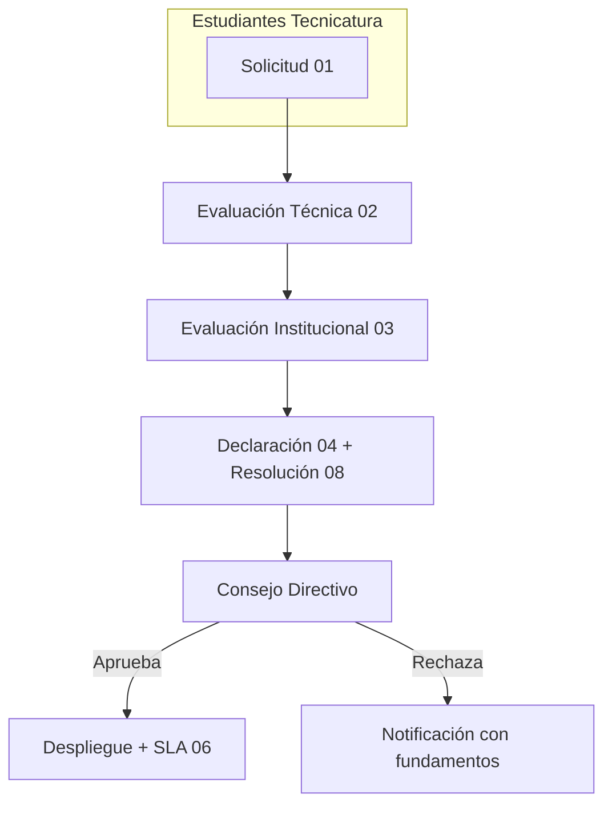

# Gobernanza de Servicios Digitales — IES 9-018

**Versión:** v0.9 — Beta Institucional
**Repositorio:** [IES9018/gobernanza-servicios-digitales](https://github.com/IES9018/gobernanza-servicios-digitales)

Marco institucional para solicitar, evaluar, aprobar, alojar y suspender servicios digitales en el servidor del IES 9-018.

> El alojamiento en infraestructura institucional **no implica aprobación, supervisión ni responsabilidad** del IES 9-018.

### Propiedad del dominio institucional

El dominio **ies9018malargue.edu.ar** y **todos sus subdominios** son propiedad
exclusiva del IES 9-018. Ningún servicio podrá publicarse bajo este dominio o
subdominios sin la aprobación formal del proceso de gobernanza
(documentos 01 al 08).

El administrador técnico es la única persona autorizada para realizar cambios
de DNS y asignación de subdominios.

---

## Desarrollo vs. Implementación

> **Analogía del restaurante escolar**

| Software | Restaurante |
|---|---|
| **Desarrollador** | Chef |
| **Código fuente** | Receta |
| **Git** | Cuaderno de recetas con control de cambios |
| **GitHub** | Cocina colaborativa donde varios chefs comparten, revisan y fusionan recetas |
| **Desarrollo (local)** | Chef probando el plato en su mesada, con sus propios ingredientes |
| **Implementación (servidor escolar)** | Servir el plato en el comedor de la escuela |
| **Infraestructura** | Cocina, mesas, sillas, vajilla, mozos, heladera, gas, luz |
| **Nombre de la institución** | El letrero que dice "IES 9-018" en la entrada del restaurante |

El **desarrollo** es lo que pasa en la computadora del programador: escribe
código, lo versiona con Git, abre Pull Requests, colabora con otros en GitHub,
prueba, corrige. Todo en su entorno local. Puede equivocarse, romper y volver
a empezar sin afectar a nadie.

La **implementación** es poner ese código en el servidor escolar para que
otros lo usen. Acá entran redes, dominio institucional, contenedores Docker,
bases de datos, seguridad, backups, monitoreo. Ya no es prueba: es un servicio
funcionando con recursos de la institución.

**Y esta infraestructura es escolar.** El servidor, la energía, la conectividad
y —sobre todo— el **nombre del IES 9-018** son recursos compartidos de toda
la comunidad educativa. Por eso no cualquier plato se sirve en el comedor:
el plato debe ser **nutritivo**, es decir, **educativo, seguro y alineado con
los valores de la institución.**

Un desarrollador puede cocinar lo que quiera en su casa. Pero si va a usar
la cocina de la escuela y servir bajo el letrero del IES 9-018, el menú
necesita aprobación. De eso trata este marco de gobernanza.

---

## Flujo de aprobación

## Documentos

| # | Documento |
|---|-----------|
| 00 | [Índice general](docs/00_INDICE.md) (empezar aquí) |
| 01 | [Solicitud de Alojamiento](docs/01_SOLICITUD_ALOJAMIENTO.md) |
| 02 | [Evaluación Técnica](docs/02_EVALUACION_TECNICA.md) |
| 03 | [Evaluación Institucional](docs/03_EVALUACION_INSTITUCIONAL.md) |
| 04 | [Declaración de Responsabilidad](docs/04_DECLARACION_RESPONSABILIDAD.md) |
| 05 | [Política de Uso Aceptable](docs/05_POLITICA_USO_ACEPTABLE.md) |
| 06 | [SLA Educativo](docs/06_SLA_EDUCATIVO.md) |
| 07 | [Solicitud de Usuario](docs/07_SOLICITUD_USUARIO.md) |
| 08 | [Resolución Directiva](docs/08_RESOLUCION_DIRECTIVA.md) |
| 09 | [Guía Técnica de Auditoría](docs/09_AUDITABILIDAD.md) |
| 10 | [Glosario](docs/10_GLOSARIO.md) |
| 11 | [Emergencia y Control](docs/11_EMERGENCIA_Y_CONTROL.md) |
| 12 | [Transparencia y Auditoría Comunitaria](docs/12_TRANSPARENCIA_COMUNITARIA.md) |

---

## Este es un proyecto vivo

Esta documentación **está en desarrollo, no está cerrada ni terminada**.
Es un marco abierto, dinámico y en evolución constante, construido colectivamente
por la comunidad del IES 9-018.

Toda sugerencia, crítica o propuesta es bienvenida y queda registrada
formalmente a través de los [Issues](https://github.com/IES9018/gobernanza-servicios-digitales/issues)
de este repositorio.

---

## Abierto a toda la comunidad educativa

Este proyecto nace desde la **Tecnicatura Superior en Desarrollo de Software**
pero está abierto a **toda la comunidad del IES 9-018**:

- **Estudiantes** — de cualquier carrera y año.
- **Docentes** — de todas las áreas.
- **Directivos** — coordinadores, consejo directivo, dirección.
- **Personal institucional** — administrativo, preceptores, biblioteca.

No hace falta saber programar para participar. La gobernanza digital nos
involucra a todos.

---

## Dejá tu sugerencia formal (Issues)

Los [Issues de GitHub](https://github.com/IES9018/gobernanza-servicios-digitales/issues)
son el canal oficial para dejar sugerencias formales sobre la gobernanza digital
de la institución. Cada Issue queda documentado con autor, fecha, contenido
y seguimiento.

Podés sugerir sobre:

- **Documentación** — corregir, ampliar o mejorar los documentos existentes.
- **Procesos** — cambios en el flujo de aprobación, roles o responsabilidades.
- **Políticas** — nuevas reglas de uso, privacidad, transparencia.
- **Sistema web** — ideas para la futura plataforma de gestión digital.
- **Cualquier tema** que consideres relevante para la gobernanza digital.

> Usá las plantillas disponibles al crear un Issue. Si tu sugerencia no
> encaja en ninguna, elegí "Sugerencia de gobernanza" y completala libremente.

[→ Abrir un Issue](https://github.com/IES9018/gobernanza-servicios-digitales/issues/new/choose)

---

## ¿Por qué participar?

- **Dejás huella** — tu sugerencia queda documentada y forma parte de la
  política institucional.
- **Formás parte** — la gobernanza digital la construimos entre todos.
- **Experiencia real** — si sos estudiante, trabajás sobre un sistema que la
  institución necesita, con revisión y despliegue real.
- **Portfolio** — tu nombre queda asociado a contribuciones públicas.

---

## ¿Qué viene después? — Sistema web de gestión

Este marco documental es el **paso 1**. El **paso 2** es desarrollar un
**sistema web liviano** para digitalizar todo el proceso: carga de solicitudes,
evaluaciones técnicas e institucionales, seguimiento de estados, catálogo de
servicios activos y dashboard para el Consejo Directivo.

Ese sistema web será **desarrollado íntegramente por estudiantes** de la
Tecnicatura, como proyecto integrador. Este repositorio solo contiene la
documentación y las reglas de negocio — el desarrollo corre por cuenta
de los alumnos, guiados por sus docentes, sin recibir el código resuelto.

Si querés participar del diseño o desarrollo, seguí los Issues con la
etiqueta `sistema-web` y sumate al equipo.

---

[Plantillas](plantillas/) · [CHANGELOG](CHANGELOG.md) · [Índice completo](docs/00_INDICE.md) · [Cómo contribuir](CONTRIBUTING.md)
