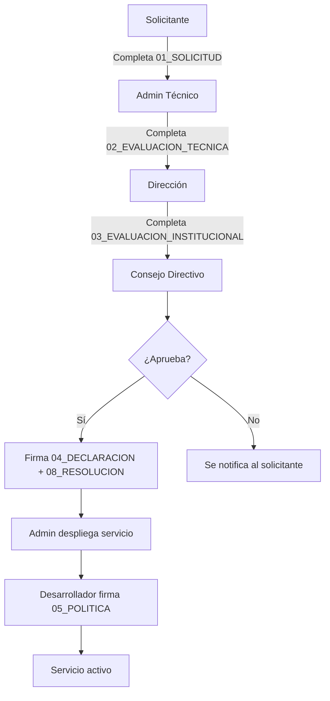

# Política de Gobernanza de Servicios Digitales — IES 9-018

**Versión:** v0.9 — Beta Institucional
**Repositorio:** [IES9018/gobernanza-servicios-digitales](https://github.com/IES9018/gobernanza-servicios-digitales)

Marco institucional para solicitar, evaluar, aprobar, alojar y suspender
servicios digitales en el servidor del **Instituto de Educación Superior
N° 9-018**, Malargüe, Mendoza.

> El alojamiento en infraestructura institucional **no implica aprobación,
> supervisión ni responsabilidad** del IES 9-018 sobre el contenido o
> actividades del servicio.

---

## Flujo de aprobación

---

## Documentos

| # | Documento | Quién lo completa |
|---|-----------|-------------------|
| 00 | [Índice general](docs/00_INDICE.md) (empezar aquí) | — |
| 01 | [Solicitud de Alojamiento](docs/01_SOLICITUD_ALOJAMIENTO.md) | Responsable del proyecto |
| 02 | [Evaluación Técnica](docs/02_EVALUACION_TECNICA.md) | Admin del servidor |
| 03 | [Evaluación Institucional](docs/03_EVALUACION_INSTITUCIONAL.md) | Dirección / Coordinación |
| 04 | [Declaración de Responsabilidad](docs/04_DECLARACION_RESPONSABILIDAD.md) | Responsable del proyecto |
| 05 | [Política de Uso Aceptable](docs/05_POLITICA_USO_ACEPTABLE.md) | Desarrolladores |
| 06 | [SLA Educativo](docs/06_SLA_EDUCATIVO.md) | Admin + Responsable |
| 07 | [Solicitud de Usuario](docs/07_SOLICITUD_USUARIO.md) | Solicitante de acceso |
| 08 | [Resolución Directiva](docs/08_RESOLUCION_DIRECTIVA.md) | Consejo Directivo |
| 09 | [Guía Técnica de Auditoría](docs/09_AUDITABILIDAD.md) | Auditor |
| 10 | [Glosario](docs/10_GLOSARIO.md) | — |
| 11 | [Emergencia y Control](docs/11_EMERGENCIA_Y_CONTROL.md) | Admin + Directivos |
| 12 | [Transparencia y Auditoría Comunitaria](docs/12_TRANSPARENCIA_COMUNITARIA.md) | Comunidad educativa |

## Plantillas

| Plantilla | Para el documento |
|-----------|------------------|
| [Solicitud de alojamiento (alumnos)](plantillas/solicitud_alu.md) | 01 |
| [Evaluación técnica](plantillas/evaluacion_tecnica.md) | 02 |
| [Evaluación institucional](plantillas/evaluacion_institucional.md) | 03 |
| [Declaración de responsabilidad](plantillas/declaracion_responsabilidad.md) | 04 |
| [Política de uso aceptable](plantillas/politica_uso_aceptable.md) | 05 |
| [SLA educativo](plantillas/sla_educativo.md) | 06 |
| [Solicitud de usuario](plantillas/solicitud_usuario.md) | 07 |

## Cómo usar este marco

1. **Solicitante** completa el [doc 01](docs/01_SOLICITUD_ALOJAMIENTO.md) (o su plantilla).
2. **Admin técnico** evalúa seguridad con el [doc 02](docs/02_EVALUACION_TECNICA.md).
3. **Dirección** evalúa pertinencia educativa con el [doc 03](docs/03_EVALUACION_INSTITUCIONAL.md).
4. **Consejo Directivo** aprueba o rechaza.
5. Si aprueba: se firma [Declaración](docs/04_DECLARACION_RESPONSABILIDAD.md) + [Resolución](docs/08_RESOLUCION_DIRECTIVA.md).
6. **Admin** despliega el servicio; **desarrollador** firma [Uso Aceptable](docs/05_POLITICA_USO_ACEPTABLE.md).

---

**IES 9-018 — Malargüe, Mendoza, Argentina**
[CHANGELOG](CHANGELOG.md) · [Índice completo](docs/00_INDICE.md)
