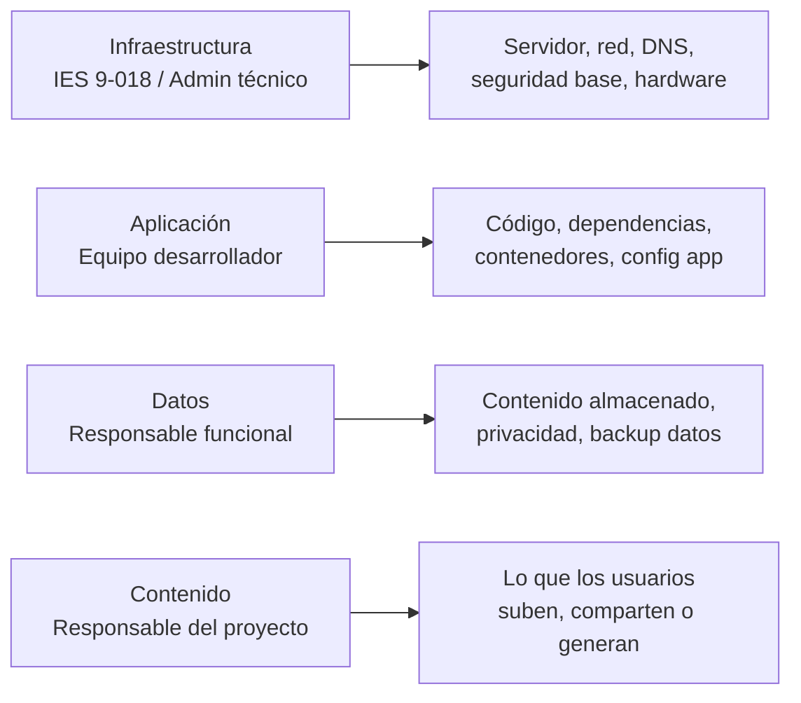
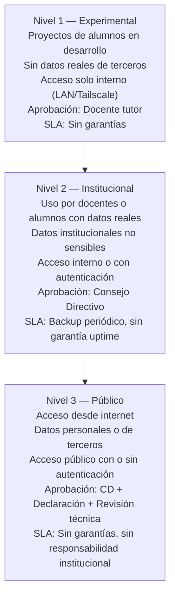
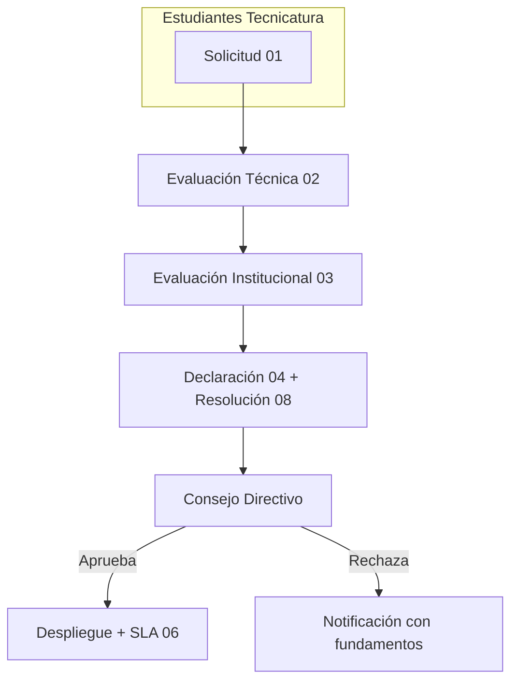

# Política de Gobernanza de Servicios Digitales — IES 9-018

**Versión:** v0.9 — Beta Institucional (próxima v1.0 al digitalizarse)
**Aprobación:** Pendiente de Consejo Directivo
**Ubicación:** `/opt/escuela/docs/gobernanza/`

---

## 1. Propósito

Establecer un marco institucional para la solicitud, evaluación, aprobación,
alojamiento y suspensión de servicios digitales en la infraestructura del
IES 9-018. Define roles, responsabilidades, niveles de servicio y
procedimientos para proteger a la institución, sus autoridades, docentes,
administradores técnicos, estudiantes desarrolladores y los datos de terceros.

Este marco está especialmente orientado a los proyectos de los alumnos de la
**Tecnicatura Superior en Desarrollo de Software** del IES 9-018, que utilizan
el servidor institucional para alojar sus trabajos prácticos, proyectos
integradores y muestras profesionales.

---

## 2. Descargo de responsabilidad institucional

> **El hecho de que una aplicación esté alojada en infraestructura institucional
> no implica aprobación, supervisión editorial ni responsabilidad institucional
> sobre los contenidos, datos o actividades desarrolladas por sus responsables.**

El IES 9-018 provee infraestructura con fines educativos. Cada proyecto es
responsabilidad exclusiva de quien lo solicita y lo mantiene.

---

## 3. Dominio institucional como activo de la institución

El dominio **ies9018malargue.edu.ar** y **todos sus subdominios**
(ej: `cualquierproyecto.ies9018malargue.edu.ar`) son **propiedad exclusiva
del IES 9-018**. Constituyen un activo digital institucional que representa
públicamente a la institución.

### Implicancias

- Cualquier servicio publicado bajo el dominio o un subdominio será percibido
  por la comunidad como avalado por el IES 9-018.
- Por lo tanto, todo subdominio requiere **aprobación expresa** mediante el
  proceso de gobernanza (documentos 01 al 08).
- El nombre del subdominio debe ser **acorde al propósito educativo** del
  servicio y aprobado por el Consejo Directivo.
- Solo el administrador técnico puede realizar cambios de DNS y asignar
  subdominios. Ningún desarrollador o docente tiene acceso a la gestión de DNS.
- El IES se reserva el derecho de **revocar un subdominio en cualquier momento**
  si el servicio deja de cumplir los requisitos institucionales.

---

## 4. Modelo de responsabilidades

| Rol | Responsable | Alcance |
|-----|-------------|---------|
| Infraestructura | IES 9-018 (admin técnico) | Servidor, red, DNS, seguridad base, disponibilidad del hardware |
| Aplicación | Equipo desarrollador | Código, dependencias, contenedores, configuración de la app |
| Datos | Responsable funcional del proyecto | Contenido almacenado, privacidad, backup de datos de la app |
| Contenido | Responsable del proyecto | Lo que los usuarios suben, comparten o generan |

---

## 5. Niveles de servicio

| Aspecto | Nivel 1 — Experimental | Nivel 2 — Institucional | Nivel 3 — Público |
|---------|------------------------|------------------------|-------------------|
| Tipo | Proyectos de alumnos en desarrollo | Uso por docentes o alumnos con datos reales | Acceso desde internet |
| Datos | Sin datos reales de terceros | Datos institucionales no sensibles | Datos personales o de terceros |
| Acceso | Solo interno (LAN o Tailscale) | Interno o con autenticación | Público con o sin autenticación |
| Aprobación | Docente tutor | Consejo Directivo | Consejo Directivo + Declaración + Revisión técnica |
| SLA | Sin garantías | Sin garantía de disponibilidad, backup periódico | Sin garantía de disponibilidad, sin responsabilidad institucional |

---

## 6. Índice de documentos

| # | Documento | Quién lo completa | Propósito |
|---|-----------|-------------------|-----------|
| 01 | [Solicitud de Alojamiento](01_SOLICITUD_ALOJAMIENTO.md) | Responsable del proyecto | Pedir formalmente el servicio (incluye justificación de arquitectura y licencia) |
| 02 | [Evaluación Técnica](02_EVALUACION_TECNICA.md) | Admin del servidor | Verificar seguridad, operabilidad, repositorio y licencia |
| 03 | [Evaluación Institucional](03_EVALUACION_INSTITUCIONAL.md) | Dirección / Coordinación | Evaluar alineación educativa, contribución al perfil profesional y riesgo |
| 04 | [Declaración de Responsabilidad](04_DECLARACION_RESPONSABILIDAD.md) | Responsable del proyecto | Liberar de responsabilidad a la institución |
| 05 | [Política de Uso Aceptable](05_POLITICA_USO_ACEPTABLE.md) | Todos los desarrolladores | Establecer reglas de convivencia digital |
| 06 | [SLA Educativo](06_SLA_EDUCATIVO.md) | Admin + Responsable | Definir nivel de servicio esperado |
| 07 | [Solicitud de Usuario](07_SOLICITUD_USUARIO.md) | Solicitante de acceso | Pedir una cuenta en el servidor |
| 08 | [Resolución Directiva](08_RESOLUCION_DIRECTIVA.md) | Consejo Directivo | Formalizar la aprobación del servicio |
| 09 | [Guía Técnica de Auditoría](09_AUDITABILIDAD.md) | Auditor / Público | Herramientas instaladas, usuario auditor, comandos |
| 10 | [Glosario](10_GLOSARIO.md) | — | Términos técnicos explicados |
| 11 | [Emergencia y Control](11_EMERGENCIA_Y_CONTROL.md) | Admin técnico + Directivos | Credenciales en sobre cerrado, blindaje de admins delegados, protección de logs |
| 12 | [Transparencia y Auditoría Comunitaria](12_TRANSPARENCIA_COMUNITARIA.md) | Toda la comunidad | Política de transparencia, derecho de auditoría, información pública vs. restringida |

---

## 7. Cómo usar este marco

### Para estudiantes (Tecnicatura en Desarrollo de Software)

1. Leer este índice y la [Política de Uso Aceptable](05_POLITICA_USO_ACEPTABLE.md).
2. Completar la [Solicitud de Alojamiento](01_SOLICITUD_ALOJAMIENTO.md) (o la [plantilla para alumnos](../plantillas/solicitud_alu.md)) con:
   - Descripción del proyecto y objetivo educativo.
   - Justificación de la arquitectura de software elegida.
   - URL del repositorio público en GitHub (o fork en la org IES9018).
   - Licencia del desarrollo (debe ser compatible con uso educativo institucional).
3. El [doc 02](02_EVALUACION_TECNICA.md) lo completa el admin técnico.
4. El [doc 03](03_EVALUACION_INSTITUCIONAL.md) lo completa dirección.
5. El Consejo Directivo evalúa y resuelve.

### Para docentes y personal

1. Leer la [Declaración de Responsabilidad](04_DECLARACION_RESPONSABILIDAD.md).
2. Si necesita acceso al servidor, completar la [Solicitud de Usuario](07_SOLICITUD_USUARIO.md).
3. Si desea alojar un servicio, seguir el flujo de aprobación desde el [doc 01](01_SOLICITUD_ALOJAMIENTO.md).

### Para auditores externos

1. Leer la [Política de Transparencia](12_TRANSPARENCIA_COMUNITARIA.md).
2. Solicitar acceso según el procedimiento descrito en ese documento.
3. La [Guía Técnica de Auditoría](09_AUDITABILIDAD.md) describe las herramientas disponibles.

---

## 8. Proceso de aprobación (flujo)

---

## 9. Transparencia y auditoría

La documentación, políticas y procesos de este repositorio son auditables por
cualquier miembro de la comunidad educativa. La seguridad del servidor no se
basa en el secreto sino en buenas prácticas, controles técnicos,
documentación abierta y trazabilidad.

| Tema | Documento |
|------|-----------|
| Política de transparencia y derecho de auditoría | [12_TRANSPARENCIA_COMUNITARIA.md](12_TRANSPARENCIA_COMUNITARIA.md) |
| Guía técnica de herramientas de auditoría | [09_AUDITABILIDAD.md](09_AUDITABILIDAD.md) |
| Blindaje de logs y control de acceso | [11_EMERGENCIA_Y_CONTROL.md](11_EMERGENCIA_Y_CONTROL.md) |
| Glosario de términos | [10_GLOSARIO.md](10_GLOSARIO.md) |

### Herramientas instaladas en el servidor

| Herramienta | Propósito |
|-------------|-----------|
| **auditd** | Registro de eventos a nivel kernel (comandos, cambios, accesos) |
| **journald** | Log central del sistema y servicios |
| **fail2ban** | Bloqueo automático de intentos de intrusión |
| **Docker logs** | Logs de cada aplicación en contenedor |
| **Server Bitácora** | Instantáneas automáticas cada 5 minutos del estado del servidor |
| **Tailscale** | Red privada con registro de dispositivos conectados |

---

## 10. Suspensión de servicios

El admin técnico puede suspender un servicio de inmediato si:

- Se detecta contenido ilegal o que viola derechos de autor.
- Se detectan vulnerabilidades de seguridad críticas.
- El servicio afecta la estabilidad del servidor.
- El responsable no responde ante incidentes.

La suspensión no requiere aprobación previa del Consejo Directivo,
pero debe notificarse dentro de las 24 horas.
