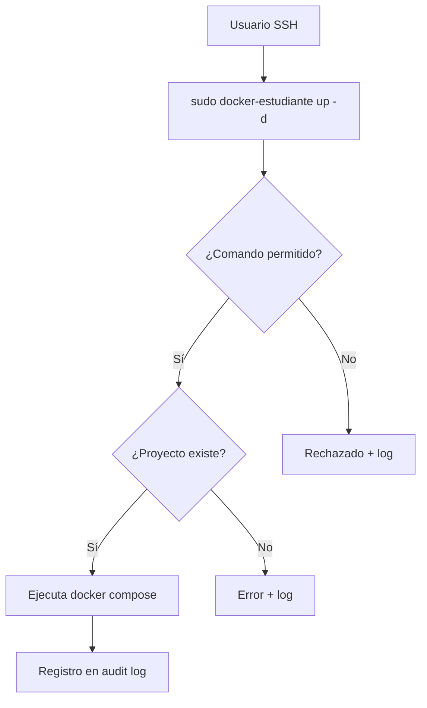

# Previsión de Infraestructura para Proyectos Estudiantiles — IES 9-018

**Versión:** v0.9 — Junio 2026
**Estado:** Implementado y disponible
**Documento relacionado:** `07_SOLICITUD_USUARIO.md` (perfiles de usuario y proceso de solicitud)

---

## 1. Propósito

Este documento describe la **infraestructura de usuarios, permisos y controles**
que ya está configurada en el servidor institucional, **anticipando la
aprobación de proyectos estudiantiles** regulados por el marco de gobernanza.

No es un escenario teórico: las cuentas, los scripts de acceso restringido,
los registros de auditoría y las reglas de sudo están operativos. Cuando un
proyecto sea aprobado, solo resta asignar los usuarios a los estudiantes y
docentes correspondientes.

---

## 2. Perfiles implementados

El servidor cuenta con dos perfiles operativos además de los existentes
(admin, auditor). Cada perfil tiene un grupo Linux, un script de acceso
restringido y reglas de sudo específicas.

| Perfil | Grupo | Script | ¿Para quién? |
|--------|-------|--------|-------------|
| **Estudiante** | `estudiantes` | `/usr/local/bin/docker-estudiante` | Alumnos de la Tecnicatura en Desarrollo de Software que alojen proyectos |
| **Docente** | `docentes` | `/usr/local/bin/docker-docente` | Docentes que supervisen proyectos o administren servicios educativos |

### 2.1 Perfil Estudiante

Cada estudiante tiene un usuario Linux estándar, sin pertenencia al grupo
`docker` ni al grupo `sudo`. Puede ejecutar únicamente el script
`docker-estudiante` mediante sudo sin contraseña.

```bash
# Comandos disponibles
sudo docker-estudiante up -d      # Iniciar su proyecto
sudo docker-estudiante down       # Detenerlo
sudo docker-estudiante ps         # Ver estado
sudo docker-estudiante logs -f    # Ver logs en vivo
sudo docker-estudiante build      # Reconstruir imagen
sudo docker-estudiante pull       # Actualizar imagen base
sudo docker-estudiante start      # Reanudar sin recrear
sudo docker-estudiante stop       # Pausar
sudo docker-estudiante restart    # Reiniciar
sudo docker-estudiante config     # Validar composición
```

**Restricciones técnicas:**

| Recurso | Bloqueado por |
|---------|---------------|
| `docker run` / `docker exec` | Usuario no pertenece al grupo `docker` |
| `sudo` arbitrario | Solo el script `docker-estudiante` está en sudoers |
| Acceso a `/opt/escuela/` | Permisos 750 (solo grupo `ies9018`) |
| Acceso a backups | `/opt/escuela/backups/` es 700 root:root |
| Lectura de `src/` de otros estudiantes | `src/` es 750, dueño del estudiante respectivo |
| Modificar `docker-compose.yml` | Archivo owned by root, solo lectura (644) |

**Ubicación del proyecto de cada estudiante:**

```
/srv/estudiantes/<usuario>/
├── docker-compose.yml   (root:root, 644)  → predefinido, no modificable
└── src/                 (<usuario>:estudiantes, 750)
    └── ...              (código editable por el estudiante)
```

Cada proyecto expone un puerto único en el servidor (8081-8085) y usa
nginx:alpine como imagen base.

### 2.2 Perfil Docente

Cada docente puede administrar los **servicios educativos existentes**
(prode-mundial y biblioteca) además de su propio proyecto experimental.

```bash
# Administrar servicios educativos
sudo docker-docente prode ps              # Estado del prode
sudo docker-docente biblioteca up -d      # Iniciar biblioteca
sudo docker-docente biblioteca down       # Detener biblioteca
sudo docker-docente biblioteca logs -f    # Ver logs

# Proyecto personal del docente
sudo docker-docente mi-proyecto up -d     # Iniciar
```

**Restricciones adicionales:**

| Recurso | Bloqueado por |
|---------|---------------|
| Servicios de infraestructura (Nextcloud, AdGuard) | No están en la lista de servicios autorizados del script |
| Variables de entorno (`.env`) de prode/biblioteca | Archivos 600, solo accesibles por root y el dueño original |
| `docker exec` / `docker run` | No están en los comandos permitidos del script |

**Ubicación del proyecto personal:**

```
/srv/docentes/<usuario>/
├── docker-compose.yml   (root:root, 644)
└── src/                 (<usuario>:docentes, 750)
```

Puertos asignados: 9091-9093.

---

## 3. Mecanismo de acceso

### 3.1 Autenticación

Los usuarios acceden al servidor por SSH con contraseña. En el primer ingreso
el sistema **obliga a cambiar la contraseña** (flag `passwd --expire`).

```
ssh estudiante1@<ip-del-servidor>
You are required to change your password immediately (administrator enforced)
Current password: <contraseña provisoria>
New password: <nueva contraseña>
Retype new password: <repetir>
```

### 3.2 Ejecución de comandos

El estudiante o docente ejecuta los comandos permitidos mediante sudo. El
script valida:

1. Que el comando esté en la lista de operaciones permitidas.
2. Que el directorio del proyecto corresponda al usuario.
3. Que el archivo `docker-compose.yml` exista.



### 3.3 Restricción técnica del grupo Docker

Ni estudiantes ni docentes pertenecen al grupo `docker`. Esto es intencional:
pertenecer al grupo `docker` equivale a tener acceso root al servidor, ya que
el socket de Docker permite montar cualquier directorio del sistema de
archivos del anfitrión.

```
$ groups estudiante1
estudiante1 : estudiante1 estudiantes

$ groups docente1
docente1 : docente1 docentes

$ grep docker /etc/group
docker:x:109:ies9018,v12.paulo
```

---

## 4. Auditoría

### 4.1 Log de comandos docente

Cada invocación del script `docker-docente` se registra en:

- **Archivo dedicado:** `/var/log/docker-docente-audit.log`
- **Syslog:** etiquetado como `docker-docente`

Formato del registro:

```
2026-06-09 17:03:06-0300 | docente1 | SERVICE=prode OP=ps ARGS= DIR=/home/lautaro/proyectos/prode
```

El archivo de auditoría tiene permisos 640, grupo `docentes` (lectura por
miembros del grupo, escritura solo root).

### 4.2 Logs del sistema

Además del log específico, todas las acciones quedan registradas por:

| Herramienta | Registro |
|-------------|----------|
| **auditd** | Eventos a nivel kernel (`ausearch -k docker_commands`) |
| **journald** | Log central del sistema |
| **Server Bitácora** | Instantáneas del estado del servidor cada 5 minutos |

Ver `09_AUDITABILIDAD.md` para una descripción detallada de cada herramienta.

---

## 5. Ampliación de permisos

Si un estudiante o docente necesita **más permisos o acceso adicional**, debe
solicitarlo formalmente mediante un Issue en el repositorio de gobernanza:

> `https://github.com/IES9018/gobernanza-servicios-digitales/issues`

Cada solicitud se evalúa según el marco de gobernanza y queda documentada
públicamente. No se otorgan permisos adicionales sin esta trazabilidad.

---

## 6. Resumen de usuarios pre-creados

| Usuario | Perfil | Puerto | Proyecto |
|---------|--------|--------|----------|
| `estudiante1` | Estudiante | 8081 | `/srv/estudiantes/estudiante1/` |
| `estudiante2` | Estudiante | 8082 | `/srv/estudiantes/estudiante2/` |
| `estudiante3` | Estudiante | 8083 | `/srv/estudiantes/estudiante3/` |
| `estudiante4` | Estudiante | 8084 | `/srv/estudiantes/estudiante4/` |
| `estudiante5` | Estudiante | 8085 | `/srv/estudiantes/estudiante5/` |
| `docente1` | Docente | 9091 | `/srv/docentes/docente1/` |
| `docente2` | Docente | 9092 | `/srv/docentes/docente2/` |
| `docente3` | Docente | 9093 | `/srv/docentes/docente3/` |

Las contraseñas provisorias se entregan directamente al responsable
institucional (no se almacenan en este repositorio ni en ningún registro
del servidor).

---

## 7. Vigencia

Estos usuarios y estructura de proyectos se mantendrán mientras el marco de
gobernanza esté activo. Al finalizar cada ciclo lectivo, los usuarios sin
actividad serán deshabilitados y sus proyectos archivados.

El administrador técnico puede crear nuevos usuarios del mismo perfil
siguiendo el procedimiento definido en `07_SOLICITUD_USUARIO.md`.
